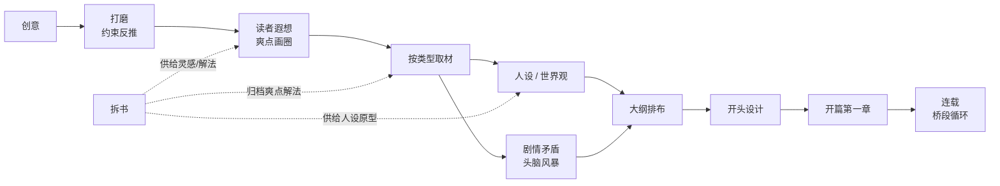

# 创作流程总纲

> 本文把《一本书是如何诞生的？完整思路大公开》与《浅谈用工程化思维，去写或拆一本书》两篇原帖（见 [资料-原帖](../资料-原帖/README.md)）提炼成一条可执行的流水线。
> 每个阶段都标注了**输入 → 动作 → 产出物**，产出物直接对应本项目的模板文件。开一本新书时，按此顺序走一遍。

## 全景流程

拆书（板块一）不在主线上，但它是主线三个环节的弹药库：**拆过的书越多，遐想时列出的爽点越准，取材时知道去哪儿找解法，人设时有原型可揉。**

## 量化标尺（全书结构）

出处：原帖·浅谈用工程化思维。

| 层级 | 数量关系 | 说明 |
| --- | --- | --- |
| 一本书 | 约 300 万字 | 男频长篇的常见体量 |
| 单元 | 40~50 个，每个 6~8 万字 | 结构完整、节奏恰当的一个故事 |
| 桥段 | 每单元 4~5 个，每个 1 万多字 ≈ 4 章 | 全书共 200~300 个桥段 |
| 章 | 每桥段约 4 章，约 2000~3000 字/章 | 四章结构见 [03-写作/桥段四章结构](../03-写作/桥段四章结构.md) |
| 剧情矛盾 | 每条 ≈ 20 章（副本事件可到 20~40 章） | 构思期攒够几十条 = 备好几百万字 |

其他关键配比：

- **升级 : 战斗 ≈ 2:1**——连续四五十章「收人/成长」剧情后，安排 20 来章「杀人/打击敌人」剧情（出处：一本书是如何诞生的，学自辰东）。
- **张弛交替**——紧绷刺激与相对舒缓的剧情必须轮换，连续紧绷读者会累，连续松弛读者会无聊。
- **开头加速**——正常 20 章一个剧情，开书前 10 万字内 10 章一个剧情。
- **大纲有效期**——前 100 万字严格执行大纲，之后允许随创作调整、增删。

## 阶段详解

### 0. 拆书（持续进行，随时补）

- 输入：对标题材的头部作品、你想写的元素对应的代表作。
- 动作：按 [01-拆书/拆书工作流](../01-拆书/拆书工作流.md) 拆到「章」的颗粒度。
- 产出：拆书笔记（存 `01-拆书/`）、爽点解法（归档进 [02-构思/爽点类型库](../02-构思/爽点类型库.md)）、人设原型。

### 1. 创意

- 输入：任何让你兴奋的碎片——一个游戏背景、一段史料、一个「如果……会怎样」。
- 动作：只做一件事，判断它**是否让你兴奋、是否有想象空间**。不急着定题材。
- 产出：一条创意记录（[02-构思/创意卡模板](../02-构思/创意卡模板.md)）。
- 原帖案例：一个「家族被诅咒、族人散落天涯、集结反攻」的老游戏背景。

### 2. 打磨（约束反推）

- 输入：创意 + 两个清单——**读者不喜欢的**（换地图、前期人物逼格不够、带兵打仗……）和**我不擅长的**（家族文、修炼升级、设定流……）。
- 动作：把「不想要的」列全，然后反推剩下的唯一解。允许创意在推演中变形——变形后更兴奋就说明对了。
- 产出：故事的雏形（主角、核心冲突、故事发生地）。
- 原帖案例：不换地图 + 前期大人物 + 不打仗 → 主角不能离开京城 → 宫廷政变 → 谍战 + 掉马甲元素。

### 3. 读者遐想（爽点画圈）

- 输入：故事雏形。
- 动作：**以读者视角**问一个问题：「如果我看到这个故事，我最想看什么？」值得花两三天只想这一个问题。把答案列成 N 条，归类成 4~6 种爽点类型。
- 产出：爽点类型清单——这就是这本书的「圈」，**全书内容只在圈内，不在圈外**（防写偏）。圈内的类型登记进 [02-构思/爽点类型库](../02-构思/爽点类型库.md)。
- 原帖案例：十项遐想（掉马甲、杀反派前揭晓身份、点破秘密拿捏大人物、副本料敌于先、利用游戏机制、修罗场、靠山撑腰、文抄、大人物赏识、皇帝魅力驾驭下属）。

### 4. 按类型取材

- 输入：爽点类型清单。
- 动作：**针对每一条类型**，找处理过同样元素的代表作（小说、剧、影游都行），看人家怎么把同一个爽点写出多种解法。大部分扫一眼即可，取材重点是**人设和解法**，不是情节。
- 产出：解法笔记（归档进爽点类型库）、人设原型素材、顺手头脑风暴出的剧情矛盾。
- 提示：取材过程中灵感会自己冒出来——手边放一个本子（或 [02-构思/剧情矛盾清单模板](../02-构思/剧情矛盾清单模板.md)），想到就记。

### 5. 人设 / 世界观

- 输入：故事雏形 + 取材得来的人设原型。
- 动作：给每个重要人物写小传（生平经历 + 形象参考图）；按阵营分组，画关系网（敌对 / 师徒 / 亲戚 / 私情 / 秘密……）。**人设即世界观**——做人设的过程就是做世界观的过程。
- 原则：
  - 每一条人物关系都是一条潜在剧情，关系越密，后续铺垫越自然；
  - 力量体系、地图等设定：题材不需要就做简，**不擅长就淡化**；
  - 人设一致性是红线——后期加趣味设定导致前后不一，是硬伤（原帖中被编辑拦下的案例）。
- 产出：[02-构思/人物小传模板](../02-构思/人物小传模板.md)、[02-构思/人物关系册](../02-构思/人物关系册.md)、[02-构思/组织设定模板](../02-构思/组织设定模板.md)、canvas 关系图（`02-构思/canvas/`）。

### 6. 剧情矛盾清单

- 输入：取材期间头脑风暴的积累。
- 动作：每条矛盾登记一句话概要、涉及人物、类型（收人 / 杀人 / 副本事件）、预计章数。**数量自检：攒够几十条才算撑起一本书。**
- 产出：[02-构思/剧情矛盾清单模板](../02-构思/剧情矛盾清单模板.md)。

### 7. 大纲排布

- 输入：几十条剧情矛盾。
- 动作：把矛盾单元串成一条线，反复检查三件事——升级:战斗 ≈ 2:1；张弛交替；相邻剧情的关联性（两段剧情同属一个事件时，读者更愿意一口气追、养书）。同时做地图分配（京城 / 地方 / 敌国 / 世界边缘）。
- 产出：[02-构思/大纲排布模板](../02-构思/大纲排布模板.md) + 大纲结构图（`02-构思/canvas/大纲结构图模板.canvas`）。

### 8. 开头设计

- 输入：定稿的大纲、人设。
- 动作：过一遍六项要求（见 [03-写作/开头设计清单](../03-写作/开头设计清单.md)）：提前亮 boss、开头美女、主角弱人设反差、少量打斗定题材、前 10 万字 10 章一个剧情、钩子拉满。构思多个版本（原帖作者写了 4 版），权衡后选定，**同时评估该版本的毒点是否可接受**。
- 产出：开头方案。

### 9. 开篇第一章

- 输入：开头方案。
- 动作：选最稳的开局模式（睁眼流）；按「选项收敛法」推导冲进来的第一个配角（能出现的人里谁最优）；人设可以「合三为一」取材（原帖案例：黑衣女子 + 五竹 + 温冉 → 开篇女护卫）。
- 产出：第一章 + 女主级配角的定稿人设。

### 10. 连载（桥段循环）

- 输入：大纲 + 桥段结构。
- 动作：按 [03-写作/桥段四章结构](../03-写作/桥段四章结构.md) 循环生产：代入 → 拉期待 → 兑现 → 承上启下。每章写完过一遍 [03-写作/发稿前自查清单](../03-写作/发稿前自查清单.md)。
- 产出：稳定更新的章节 + 定期回填大纲（100 万字后）。

## 判断与取舍（贯穿全程）

这些没有流程可依，依赖「网文审美」，但原帖给出了思考坐标：

1. **保留还是舍弃**——看两点：我对这个元素是否擅长（擅长则放大，不擅长则淡化），它与题材是否匹配（权谋题材着重写修炼战斗就是不匹配）。
2. **毒点与亮点是一体两面**——不追求无毒点，完全没有毒点的书往往毫无亮点；最火的书也只能让一小撮读者喜欢。取舍标准是「这个毒点换来的亮点值不值」，且最好有编辑/旁观者帮你看一眼。
3. **成绩与流程复杂度无关**——复杂流程买到的不是成绩，是**过程中的满足感和更稳的结构**。想清楚自己要什么，再选择走哪条路。
